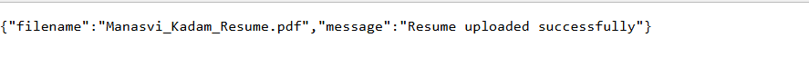
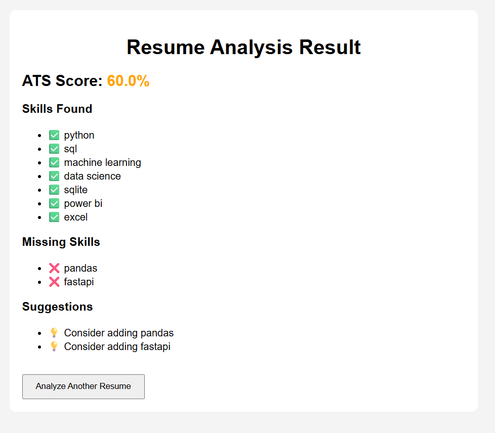

# Resume ATS Analyzer

A simple web app that analyzes a resume PDF against job description
skills and gives an ATS (Applicant Tracking System) match score.

## Features
- Upload a resume in PDF format
- Extracts text from the resume automatically
- Compares resume skills against a sample job description
- Lets you paste a custom job description and get a tailored score
- Shows missing skills and suggestions to improve the resume
- Saves past analysis results to a database (history)

## Tech Stack
- **Backend:** FastAPI (Python)
- **PDF Parsing:** pdfplumber
- **Templating:** Jinja2
- **Database:** SQLite
- **Server:** Uvicorn

## 📸 Screenshots
#### Home Page

#### Upload

#### Result



## Project Structure

├── main.py            # FastAPI app and routes
├── parser.py          # Extracts text from PDF resumes
├── analyzer.py        # Matches skills and calculates ATS score
├── database.py        # Saves and reads analysis history
├── skills_db.json      # List of known skills to check for
├── templates/          # HTML pages (index.html, result.html)
├── static/             # CSS/JS files
└── requirements.txt    # Python dependencies

## How It Works
1. User uploads a resume (PDF).
2. `parser.py` extracts the text from the PDF.
3. `analyzer.py` checks which known skills appear in the resume.
4. The app compares those skills against a job description's
   required skills and calculates a percentage match score.
5. Missing skills and suggestions are shown to the user.
6. Each analysis is saved to a SQLite database for history tracking.

## Setup & Run Locally

```bash
# 1. Clone the repository
git clone <your-repo-url>
cd resume-ats-analyzer

# 2. Create a virtual environment (optional but recommended)
python -m venv venv
venv\Scripts\activate      # Windows
source venv/bin/activate   # Mac/Linux

# 3. Install dependencies
pip install -r requirements.txt

# 4. Run the app
uvicorn main:app --reload
```

Then open your browser at: `http://127.0.0.1:8000`

## API Routes
| Method | Route | Description |
|--------|-------|-------------|
| GET | `/` | Home page |
| POST | `/upload` | Upload a resume PDF |
| GET | `/analyze` | Analyze resume against a sample job description |
| POST | `/analyze-jd` | Analyze resume against a custom job description |
| GET | `/history` | View past analysis results |

## Future Improvements
- Support multiple users with separate uploaded resumes
- Add a proper history page (HTML table instead of raw JSON)
- Deploy live (Render / Railway) for public demo access

## Author
Manasvi Mangesh Kadam 
